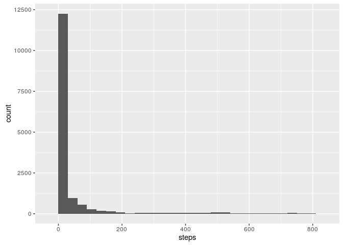
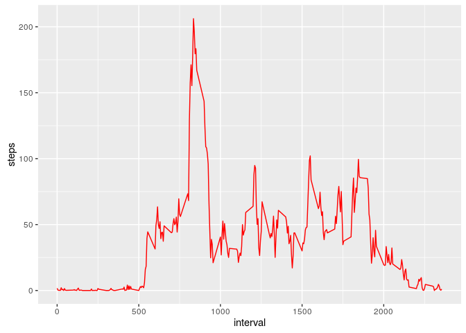
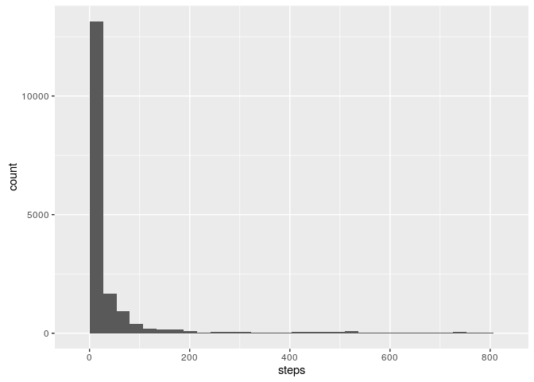
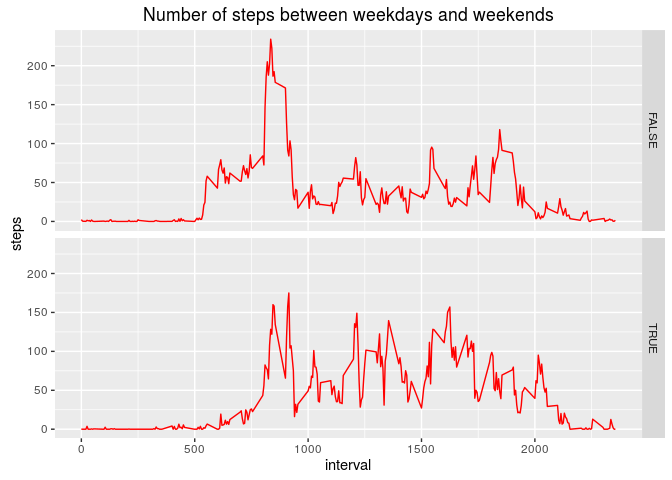

# Reproducible Research: Peer Assessment 1


## Loading and preprocessing the data


```r
data = read.csv("activity.csv")
head(data)
```

```
##   steps       date interval
## 1    NA 2012-10-01        0
## 2    NA 2012-10-01        5
## 3    NA 2012-10-01       10
## 4    NA 2012-10-01       15
## 5    NA 2012-10-01       20
## 6    NA 2012-10-01       25
```

```r
class(data)
```

```
## [1] "data.frame"
```

```r
data.clean = data[complete.cases(data), ]
```

## What is mean total number of steps taken per day?

a histogram of the total number of steps taken each day


```r
library("ggplot2")
g = ggplot(data.clean, aes(steps))
g+geom_histogram(binwidth = 30)
```



mean and median total number of steps taken per day


```r
Data_day = aggregate(steps ~ date, data=data, FUN = "sum")
print(mean(Data_day$steps))
```

```
## [1] 10766.19
```

```r
print(median(Data_day$steps))
```

```
## [1] 10765
```


## What is the average daily activity pattern?

calculating the average number of steps taken, averaged across all days


```r
data.average <- aggregate(steps ~ interval, data=data.clean, FUN = "mean")
head(data.average)
```

```
##   interval     steps
## 1        0 1.7169811
## 2        5 0.3396226
## 3       10 0.1320755
## 4       15 0.1509434
## 5       20 0.0754717
## 6       25 2.0943396
```

ploting the data

```r
p <- ggplot(data.average, aes(x= interval, y=steps))
p+geom_line(col="red")
```



interval, on average across all the days in the dataset,contains the maximum number of steps


```r
data.average[data.average$steps==max(data.average$steps),]$interval
```

```
## [1] 835
```


## Imputing missing values
number of missing values
total

```r
sum(!complete.cases(data))
```

```
## [1] 2304
```
in steps column

```r
sum(is.na(data$steps))
```

```
## [1] 2304
```
in date column

```r
sum(is.na(data$date))
```

```
## [1] 0
```
in interval column 

```r
sum(is.na(data$interval))
```

```
## [1] 0
```
filling the missing values

```r
data.final = data.frame(steps=integer(0), date=character(0), interval=integer(0))

for (i in unique(data$interval)) {
    data.NA <- subset(data, interval==i)
    mean.NA = mean(data.NA$steps[!is.na(data.NA$steps)])
    data.NA[is.na(data.NA)]<-mean.NA
    data.final <- rbind(data.final, data.NA)
    }
```

a histogram of the total number of steps taken each day

```r
library(ggplot2)
h<-ggplot(data.final, aes(steps))
h+geom_histogram()
```

```
## `stat_bin()` using `bins = 30`. Pick better value with `binwidth`.
```


calculating mean and median

```r
Data_day.final = aggregate(steps ~ date, data=data.final, FUN = "sum")
print(mean(Data_day.final$steps))
```

```
## [1] 10766.19
```

```r
print(median(Data_day.final$steps))
```

```
## [1] 10766.19
```


## Are there differences in activity patterns between weekdays and weekends?

converting date column to date format

```r
data$date <- as.Date(data$date, format="%Y-%m-%d")
class(data.final$date)
```

```
## [1] "factor"
```

```r
library(chron)

data.weekend <- data.frame(data, weekend = is.weekend(data$date))

Avr.weekday <- aggregate(steps ~ interval + weekend, data=data.weekend, FUN = "mean")
```
plotting weekday data

```r
library(ggplot2)
k<-ggplot(Avr.weekday, aes(x=interval, y=steps))
k+geom_line(col="red")+facet_grid(weekend~.)+
  labs(title = "Number of steps between weekdays and weekends")
```




