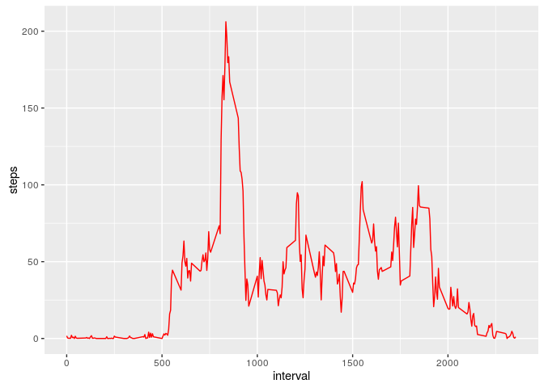

# Reproducible Research: Peer Assessment 1


## Loading and preprocessing the data


```r
data = read.csv("activity.csv")
head(data)
```

```
##   steps       date interval
## 1    NA 2012-10-01        0
## 2    NA 2012-10-01        5
## 3    NA 2012-10-01       10
## 4    NA 2012-10-01       15
## 5    NA 2012-10-01       20
## 6    NA 2012-10-01       25
```

```r
class(data)
```

```
## [1] "data.frame"
```

```r
data.clean = data[complete.cases(data), ]
```

## What is mean total number of steps taken per day?

a histogram of the total number of steps taken each day


```r
library("ggplot2")
g = ggplot(data.clean, aes(steps))
g+geom_histogram(binwidth = 30)
```


mean and median total number of steps taken per day


```r
Data_mean = mean(data.clean$steps)
print(Data_mean)
```

```
## [1] 37.3826
```

```r
Data_med = median(data.clean$steps)
print(Data_med)
```

```
## [1] 0
```


## What is the average daily activity pattern?

calculating the average number of steps taken, averaged across all days


```r
data.average <- aggregate(steps ~ interval, data=data.clean, FUN = "mean")
head(data.average)
```

```
##   interval     steps
## 1        0 1.7169811
## 2        5 0.3396226
## 3       10 0.1320755
## 4       15 0.1509434
## 5       20 0.0754717
## 6       25 2.0943396
```

ploting the data

```r
p <- ggplot(data.average, aes(x= interval, y=steps))
p+geom_line(col="red")
```



interval, on average across all the days in the dataset,contains the maximum number of steps


```r
data.average[data.average$steps==max(data.average$steps),]$interval
```

```
## [1] 835
```


## Imputing missing values


## Are there differences in activity patterns between weekdays and weekends?
